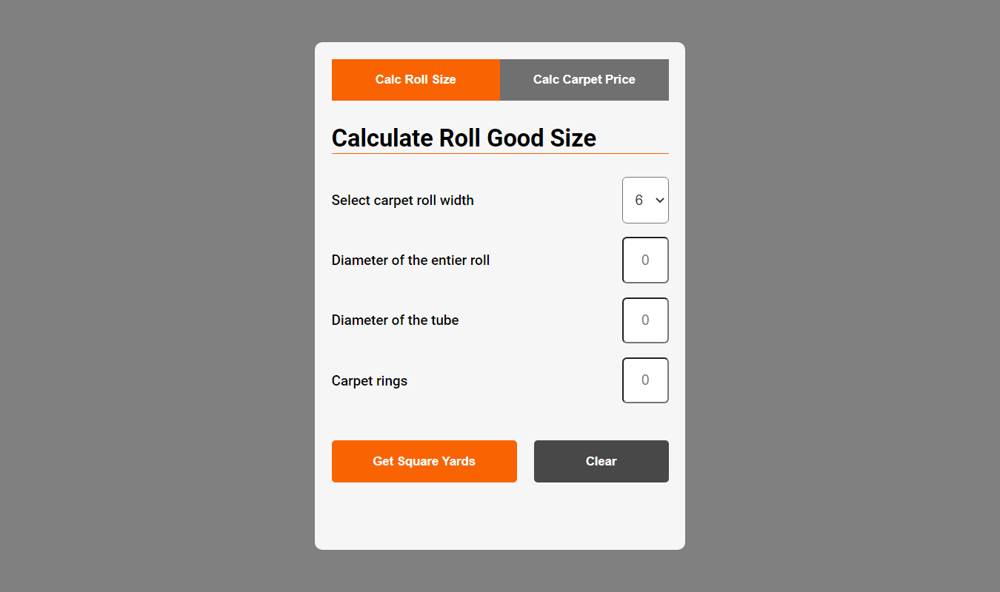
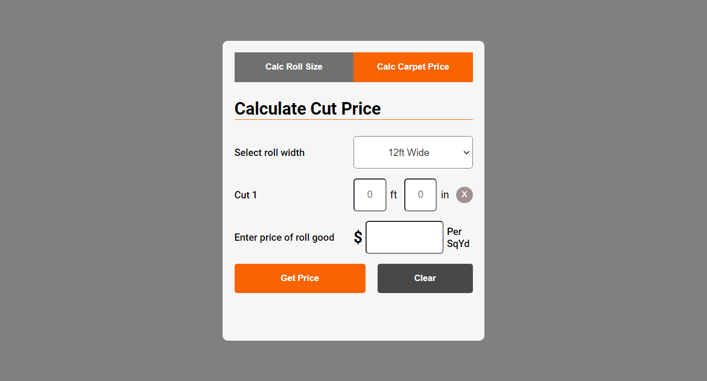

# Home Depot Rolled Goods Inventory Calculator / Price Calculator

### Screenshot 1 - Carpet Roll Size Calculator

### Screenshot 2 - Carpet Cut Size Calculator

- [Github Pages live link](https://rudyjm3.github.io/carpet-roll-calculator/)
- [Netlify live link](https://carpet-cal.netlify.app/)

## Project Overview
This project was inspired by preping for inventory for the store Nov 2022. The application figures the square yards of rolled goods still on the pin. The application also has another function to take inputted cut sizes, and price of the product to give the user a total square yard of cut/s and price. 

### Helpful Links

- [Adding text before ordered list item](https://stackoverflow.com/questions/9258070/adding-text-before-list)
- [How to Retrieve the Text of the Selected option Element in a select Element with JavaScript?](https://javascript.plainenglish.io/how-to-retrieve-the-text-of-the-selected-option-element-in-a-select-element-with-javascript-6933e5d4457d)
- [JavaScript Array forEach() resource 1](https://www.w3schools.com/jsref/jsref_foreach.asp)
- [JavaScript Array forEach() resource 2](https://vanillajstoolkit.com/reference/loops/array-foreach/)
- [Converting a NodeList to an array with vanilla JavaScript](https://gomakethings.com/converting-a-nodelist-to-an-array-with-vanilla-javascript/)
- [Getting all of a form's elements with vanilla JS](https://gomakethings.com/getting-all-of-a-forms-elements-with-vanilla-js/)
- [HTML <select> form Attribute](https://www.w3schools.com/tags/att_select_form.asp)
- [How to test if an element contains class in JavaScript in HTML?](https://www.tutorialspoint.com/How-to-test-if-an-element-contains-class-in-JavaScript-in-HTML)
- [How do I select elements whose class name starts with a specific word?](https://stackoverflow.com/questions/58524685/how-do-i-select-elements-whose-class-name-starts-with-a-specific-word)
- [Array.from()](https://developer.mozilla.org/en-US/docs/Web/JavaScript/Reference/Global_Objects/Array/from)
- [Select Box Validation in JavaScript](https://www.roseindia.net/javascript/select-box.shtml)
- [How to efficiently validate multiple input fields in a form](https://stackoverflow.com/questions/53351438/how-to-efficiently-validate-multiple-input-fields-in-a-form)
- [How to get values from html input array using JavaScript ?](https://www.geeksforgeeks.org/how-to-get-values-from-html-input-array-using-javascript/)
- [Setting the Form Action with a JavaScript Function](https://html.form.guide/html-form/form-action-using-javascript-function/)
- [5 Ways To Loop Over DOM Elements With QuerySelectorAll in JavaScript](https://itnext.io/5-ways-to-loop-over-dom-elements-from-queryselectorall-in-javascript-55bd66ca4128)

- [Add or remove multiple classes ES6](https://developer.mozilla.org/en-US/docs/Web/API/Element/classList#examples)
- [Hide the HTML5 number input’s spin box?](https://stackoverflow.com/questions/3790935/can-i-hide-the-html5-number-input-s-spin-box)
- [Scope of variables](https://www.w3schools.com/js/js_scope.asp)
- [Carpet icon](https://www.istockphoto.com/illustrations/rolled-up-carpet)
- [Format number to always show 2 decimal places](https://stackoverflow.com/questions/6134039/format-number-to-always-show-2-decimal-places/34796988#34796988)
- ['Search term' how to input decimales for an input](https://www.google.com/search?q=how+to+input+decimales+for+an+input&rlz=1C1CHBF_enUS746US746&oq=how+to+input+decimales+for+an+input&aqs=chrome..69i57j33i10i160l3j33i22i29i30.10794j0j7&sourceid=chrome&ie=UTF-8)
- [Search term- get value of an input javascript](https://www.google.com/search?q=get+value+of+an+input+javascript&rlz=1C1CHBF_enUS746US746&oq=get+value+of+an+&aqs=chrome.1.0i512l3j69i57j0i512l3j69i65.11894j0j7&sourceid=chrome&ie=UTF-8)
- [How to Define Global Variable in a JavaScript Function](https://www.w3docs.com/snippets/javascript/how-to-define-global-variable-in-a-javascript-function.html)
- [Creating a tab section](https://www.w3schools.com/howto/howto_js_tabs.asp)
- [addEventListener is not a function in JavaScript](https://bobbyhadz.com/blog/javascript-addeventlistener-is-not-a-function)
- [Convert Feet/Inches/Fractions to Decimal Format](https://www.spikevm.com/how-to/fractions-to-decimal.php)